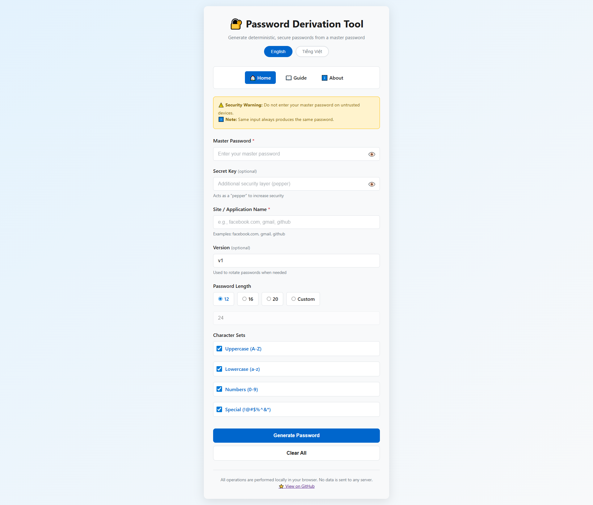

# Password Derivation Tool

A secure, client-side password generation tool that creates deterministic passwords from a master password.

## 📸 Screenshot



## 🌟 Features

- **100% Client-Side**: All operations happen in your browser - no data sent to any server
- **Deterministic Generation**: Same inputs always produce the same password
- **Strong Cryptography**: Uses PBKDF2 with SHA-256 and 100,000 iterations
- **Bilingual Support**: English and Vietnamese (Tiếng Việt)
- **No Dependencies**: Uses only native Web Crypto API
- **Offline Capable**: Works without internet connection
- **Light Theme**: Clean, modern interface with light color scheme

## 📁 Files

- `index.html` - Main password generation page
- `guide.html` - User guide with step-by-step instructions
- `about.html` - About page with technical details
- `style.css` - Styling for all pages (light theme)
- `app.js` - Password generation logic

## 🚀 Usage

Simply open `index.html` in any modern web browser. No installation or build process required.

### Basic Workflow:

1. Enter your master password
2. (Optional) Add a secret key for extra security
3. Enter the site/application name
4. Choose password length and character sets
5. Click "Generate Password"
6. Copy the generated password
7. Click "Clear All" when done

## 🔐 Security

- **PBKDF2 Algorithm**: Industry-standard key derivation with 100,000 iterations
- **No Storage**: Nothing saved to localStorage, cookies, or any storage
- **No Network Requests**: All processing happens locally
- **No Console Logging**: Sensitive data never logged
- **Auto-clear**: Fields cleared on page refresh

### How It Works:

```
Input = masterPassword + "|" + secretKey
Salt = siteName + "|" + version
DerivedKey = PBKDF2(Input, Salt, 100000, SHA-256, 256 bits)
Password = MapToCharset(DerivedKey, selectedCharsets, desiredLength)
```

## 🌐 Browser Compatibility

Works on all modern browsers supporting Web Crypto API:

- Chrome 37+
- Firefox 34+
- Safari 11+
- Edge 79+
- Opera 24+

## 📖 Documentation

- **Guide Page**: Comprehensive user guide with examples and best practices
- **About Page**: Technical details, security principles, and FAQ

## 🌍 Language Support

Toggle between English and Vietnamese using the language buttons at the top of each page.

## ⚠️ Important Notes

- **No Recovery**: If you forget your master password, there's no way to recover it
- **Consistency**: Always use the same site name format for each service
- **Trusted Devices**: Only use this tool on devices you trust
- **Backup**: Write down your master password and secret key in a safe place

## 📄 License

Free and open-source software. Use at your own discretion.

## 🔒 Privacy

This tool:

- ✅ Collects no data
- ✅ Uses no analytics
- ✅ Makes no network requests
- ✅ Stores nothing permanently
- ✅ Runs entirely in your browser

---

**Made with security in mind** 🔐
